# [📈 Live Status](https://linkspreed.github.io/status): <!--live status--> **🟩 All systems operational**

This repository contains the open-source uptime monitor and status page for [Linkspreed](https://linkspreed.com), powered by [Upptime](https://github.com/upptime/upptime).

With [Upptime](https://upptime.js.org), you can get your own unlimited and free uptime monitor and status page, powered entirely by a GitHub repository. We use [Issues](https://github.com/linkspreed/status/issues) as incident reports, [Actions](https://github.com/linkspreed/status/actions) as uptime monitors, and [Pages](https://linkspreed.github.io/status) for the status page.

<!--start: status pages-->
<!-- This summary is generated by Upptime (https://github.com/upptime/upptime) -->
<!-- Do not edit this manually, your changes will be overwritten -->
<!-- prettier-ignore -->
| URL | Status | History | Response Time | Uptime |
| --- | ------ | ------- | ------------- | ------ |
|  [LINKSPREED Website](https://linkspreed.com) | 🟩 Up | [linkspreed-website.yml](https://github.com/linkspreed/status/commits/HEAD/history/linkspreed-website.yml) | 

 168ms
     
 | 

<a href="https://status.linkspreed.com/history/linkspreed-website">100.00%</a>
    

|  [Web4.one](https://web4.one) | 🟩 Up | [web4-one.yml](https://github.com/linkspreed/status/commits/HEAD/history/web4-one.yml) | 

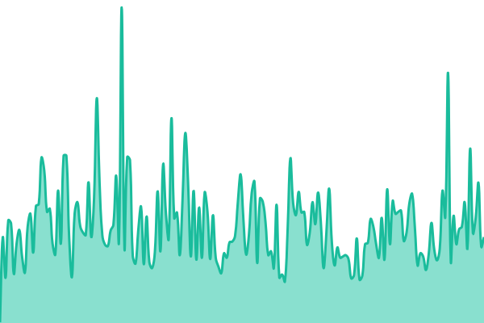 94ms
     
 | 

<a href="https://status.linkspreed.com/history/web4-one">100.00%</a>
    

|  [Trive (Web4)](https://trive.web4.one) | 🟩 Up | [trive-web4.yml](https://github.com/linkspreed/status/commits/HEAD/history/trive-web4.yml) | 

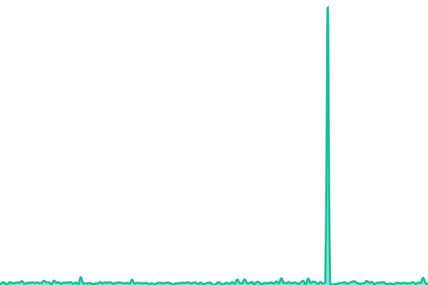 74ms
     
 | 

<a href="https://status.linkspreed.com/history/trive-web4">100.00%</a>
    

|  [AI](https://ai.linkspreed.com) | 🟩 Up | [ai.yml](https://github.com/linkspreed/status/commits/HEAD/history/ai.yml) | 

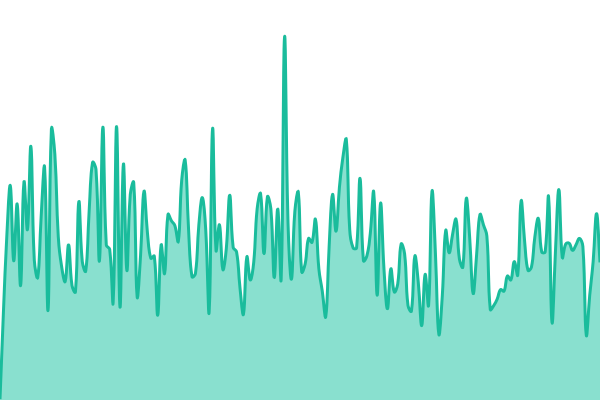 177ms
     
 | 

<a href="https://status.linkspreed.com/history/ai">100.00%</a>
    

|  [Arctic](https://arctic.linkspreed.com) | 🟩 Up | [arctic.yml](https://github.com/linkspreed/status/commits/HEAD/history/arctic.yml) | 

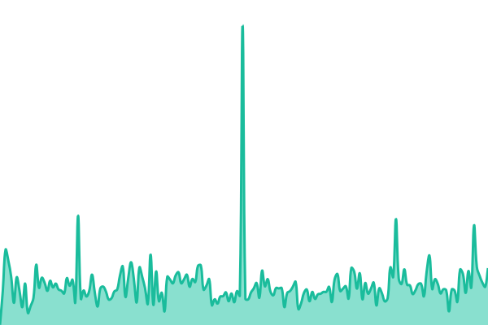 192ms
     
 | 

<a href="https://status.linkspreed.com/history/arctic">100.00%</a>
    

|  [Atrium](https://atrium.linkspreed.com) | 🟩 Up | [atrium.yml](https://github.com/linkspreed/status/commits/HEAD/history/atrium.yml) | 

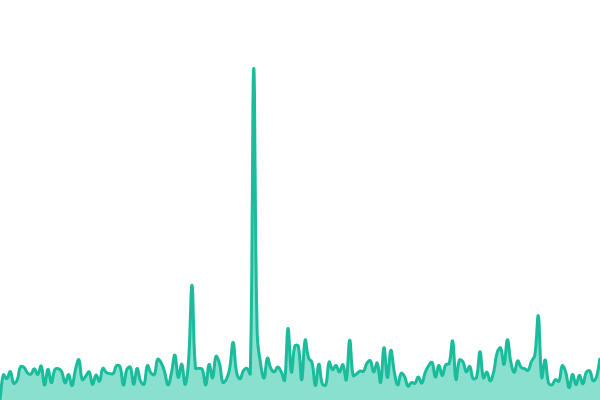 180ms
     
 | 

<a href="https://status.linkspreed.com/history/atrium">100.00%</a>
    

|  [Delta](https://delta.linkspreed.com) | 🟩 Up | [delta.yml](https://github.com/linkspreed/status/commits/HEAD/history/delta.yml) | 

 138ms
     
 | 

<a href="https://status.linkspreed.com/history/delta">100.00%</a>
    

|  [Devs](https://devs.linkspreed.com) | 🟩 Up | [devs.yml](https://github.com/linkspreed/status/commits/HEAD/history/devs.yml) | 

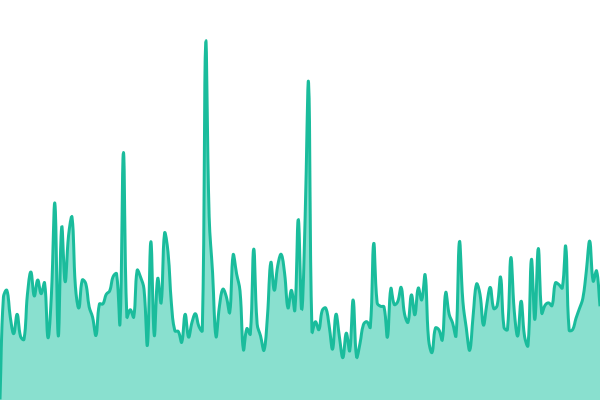 329ms
     
 | 

<a href="https://status.linkspreed.com/history/devs">100.00%</a>
    

|  [Everything](https://everything.linkspreed.com) | 🟩 Up | [everything.yml](https://github.com/linkspreed/status/commits/HEAD/history/everything.yml) | 

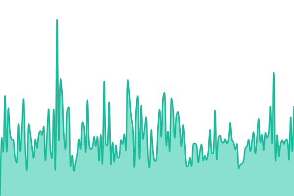 295ms
     
 | 

<a href="https://status.linkspreed.com/history/everything">100.00%</a>
    

|  [Flow](https://flow.linkspreed.com) | 🟩 Up | [flow.yml](https://github.com/linkspreed/status/commits/HEAD/history/flow.yml) | 

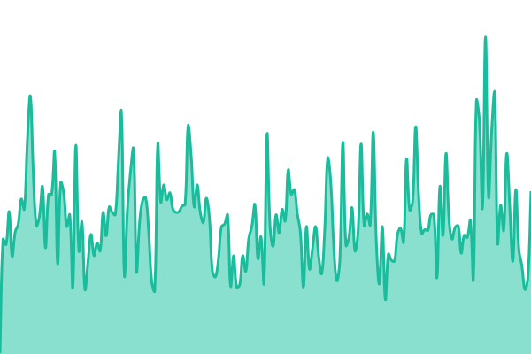 194ms
     
 | 

<a href="https://status.linkspreed.com/history/flow">100.00%</a>
    

|  [Glacier](https://glacier.linkspreed.com) | 🟩 Up | [glacier.yml](https://github.com/linkspreed/status/commits/HEAD/history/glacier.yml) | 

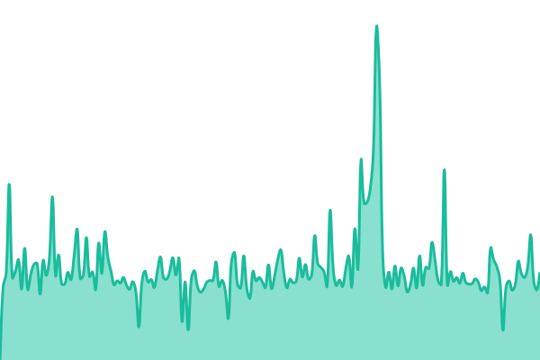 1690ms
     
 | 

<a href="https://status.linkspreed.com/history/glacier">100.00%</a>
    

|  [Gravity51](https://gravity51.linkspreed.com) | 🟩 Up | [gravity51.yml](https://github.com/linkspreed/status/commits/HEAD/history/gravity51.yml) | 

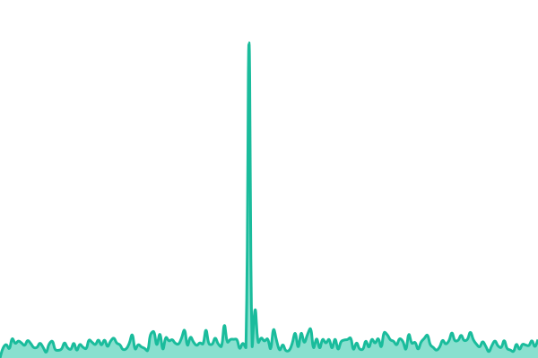 282ms
     
 | 

<a href="https://status.linkspreed.com/history/gravity51">100.00%</a>
    

|  [Group](https://group.linkspreed.com) | 🟩 Up | [group.yml](https://github.com/linkspreed/status/commits/HEAD/history/group.yml) | 

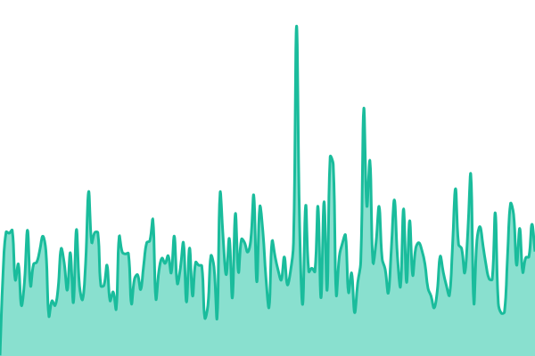 166ms
     
 | 

<a href="https://status.linkspreed.com/history/group">100.00%</a>
    

|  [Helion](https://helion.linkspreed.com) | 🟩 Up | [helion.yml](https://github.com/linkspreed/status/commits/HEAD/history/helion.yml) | 

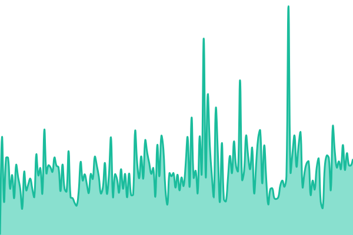 130ms
     
 | 

<a href="https://status.linkspreed.com/history/helion">100.00%</a>
    

|  [Help](https://help.linkspreed.com) | 🟩 Up | [help.yml](https://github.com/linkspreed/status/commits/HEAD/history/help.yml) | 

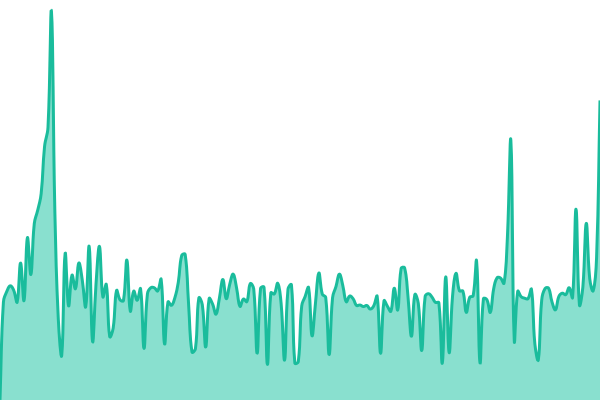 810ms
     
 | 

<a href="https://status.linkspreed.com/history/help">100.00%</a>
    

|  [Horizon](https://horizon.linkspreed.com) | 🟩 Up | [horizon.yml](https://github.com/linkspreed/status/commits/HEAD/history/horizon.yml) | 

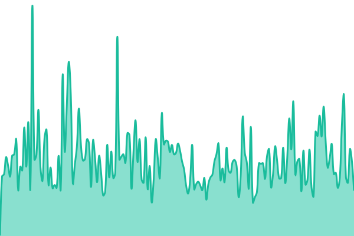 187ms
     
 | 

<a href="https://status.linkspreed.com/history/horizon">100.00%</a>
    

|  [Investors](https://investors.linkspreed.com) | 🟩 Up | [investors.yml](https://github.com/linkspreed/status/commits/HEAD/history/investors.yml) | 

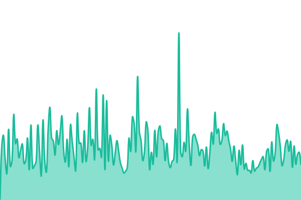 125ms
     
 | 

<a href="https://status.linkspreed.com/history/investors">100.00%</a>
    

|  [Legal](https://legal.linkspreed.com) | 🟩 Up | [legal.yml](https://github.com/linkspreed/status/commits/HEAD/history/legal.yml) | 

 111ms
     
 | 

<a href="https://status.linkspreed.com/history/legal">100.00%</a>
    

|  [LSP](https://lsp.linkspreed.com) | 🟩 Up | [lsp.yml](https://github.com/linkspreed/status/commits/HEAD/history/lsp.yml) | 

 143ms
     
 | 

<a href="https://status.linkspreed.com/history/lsp">100.00%</a>
    

|  [MLM](https://mlm.linkspreed.com) | 🟩 Up | [mlm.yml](https://github.com/linkspreed/status/commits/HEAD/history/mlm.yml) | 

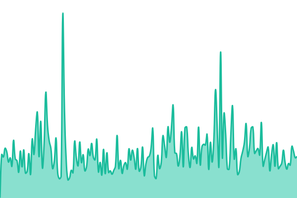 239ms
     
 | 

<a href="https://status.linkspreed.com/history/mlm">100.00%</a>
    

|  [Opensource](https://opensource.linkspreed.com) | 🟩 Up | [opensource.yml](https://github.com/linkspreed/status/commits/HEAD/history/opensource.yml) | 

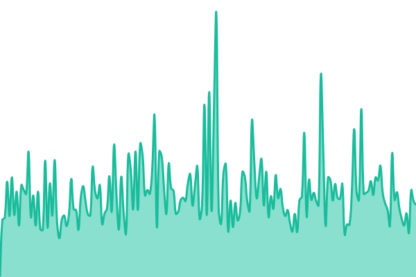 172ms
     
 | 

<a href="https://status.linkspreed.com/history/opensource">100.00%</a>
    

|  [Partner](https://partner.linkspreed.com) | 🟩 Up | [partner.yml](https://github.com/linkspreed/status/commits/HEAD/history/partner.yml) | 

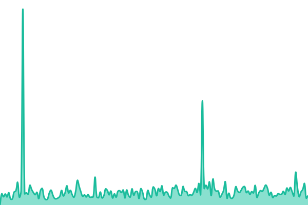 100ms
     
 | 

<a href="https://status.linkspreed.com/history/partner">100.00%</a>
    

|  [Pi](https://pi.linkspreed.com) | 🟩 Up | [pi.yml](https://github.com/linkspreed/status/commits/HEAD/history/pi.yml) | 

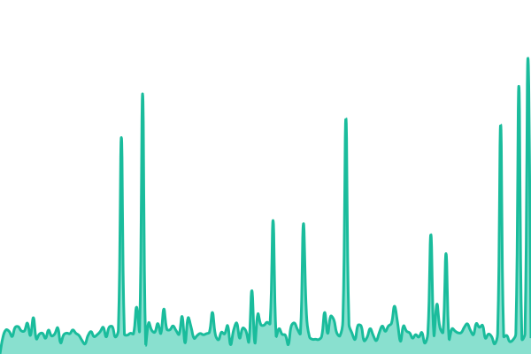 121ms
     
 | 

<a href="https://status.linkspreed.com/history/pi">100.00%</a>
    

|  [Search](https://search.linkspreed.com) | 🟩 Up | [search.yml](https://github.com/linkspreed/status/commits/HEAD/history/search.yml) | 

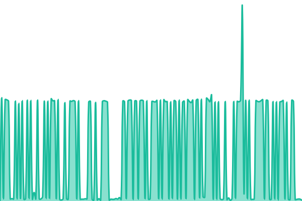 9944ms
     
 | 

<a href="https://status.linkspreed.com/history/search">100.00%</a>
    

|  [Source](https://source.linkspreed.com) | 🟩 Up | [source.yml](https://github.com/linkspreed/status/commits/HEAD/history/source.yml) | 

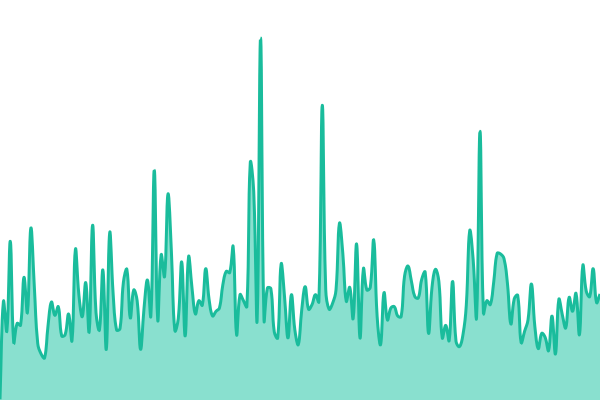 154ms
     
 | 

<a href="https://status.linkspreed.com/history/source">100.00%</a>
    

|  [Status](https://status.linkspreed.com) | 🟩 Up | [status.yml](https://github.com/linkspreed/status/commits/HEAD/history/status.yml) | 

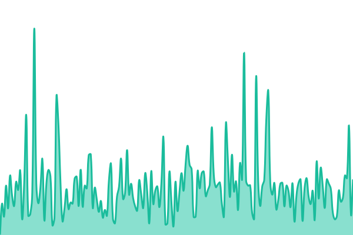 99ms
     
 | 

<a href="https://status.linkspreed.com/history/status">0.00%</a>
    

|  [Super](https://super.linkspreed.com) | 🟩 Up | [super.yml](https://github.com/linkspreed/status/commits/HEAD/history/super.yml) | 

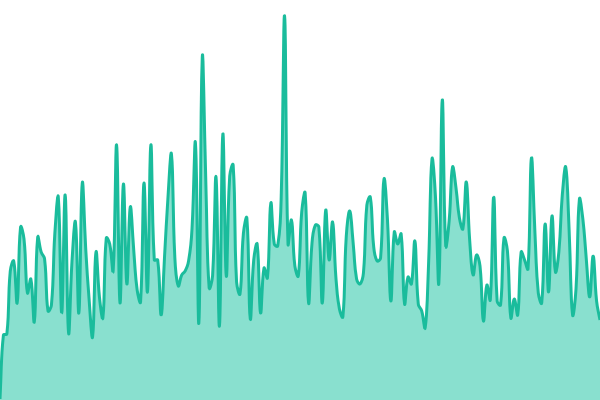 129ms
     
 | 

<a href="https://status.linkspreed.com/history/super">100.00%</a>
    

|  [Trive](https://trive.linkspreed.com) | 🟩 Up | [trive.yml](https://github.com/linkspreed/status/commits/HEAD/history/trive.yml) | 

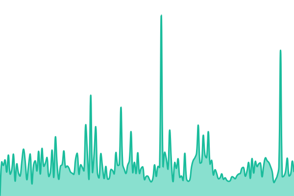 118ms
     
 | 

<a href="https://status.linkspreed.com/history/trive">100.00%</a>
    

|  [UIID](https://uiid.linkspreed.com) | 🟩 Up | [uiid.yml](https://github.com/linkspreed/status/commits/HEAD/history/uiid.yml) | 

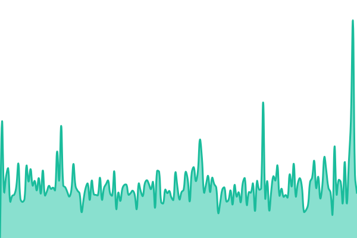 340ms
     
 | 

<a href="https://status.linkspreed.com/history/uiid">100.00%</a>
    

|  [Vivon](https://vivon.linkspreed.com) | 🟩 Up | [vivon.yml](https://github.com/linkspreed/status/commits/HEAD/history/vivon.yml) | 

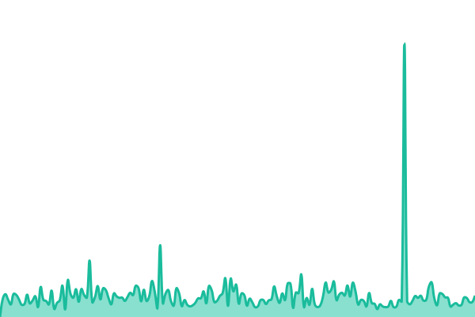 229ms
     
 | 

<a href="https://status.linkspreed.com/history/vivon">100.00%</a>
    

|  [Wynix](https://wynix.linkspreed.com) | 🟩 Up | [wynix.yml](https://github.com/linkspreed/status/commits/HEAD/history/wynix.yml) | 

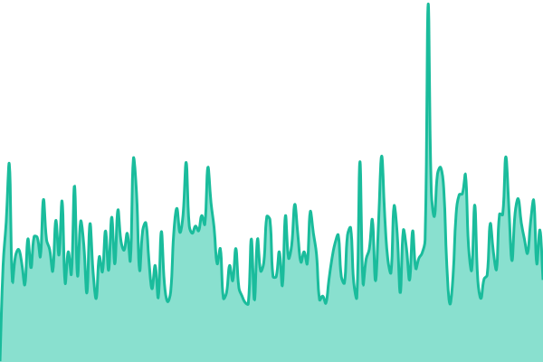 195ms
     
 | 

<a href="https://status.linkspreed.com/history/wynix">100.00%</a>
    

|  [Y](https://y.linkspreed.com) | 🟩 Up | [y.yml](https://github.com/linkspreed/status/commits/HEAD/history/y.yml) | 

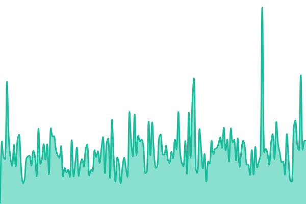 106ms
     
 | 

<a href="https://status.linkspreed.com/history/y">100.00%</a>
    

<!--end: status pages-->

[**Visit our status website →**](https://linkspreed.github.io/status)

## 📄 License

- Powered by: [Upptime](https://github.com/upptime/upptime)
- Code: [MIT](./LICENSE) © [Anand Chowdhary](https://anandchowdhary.com)
- Data in the `./history` directory: [Open Database License](https://opendatacommons.org/licenses/odbl/1-0/)
